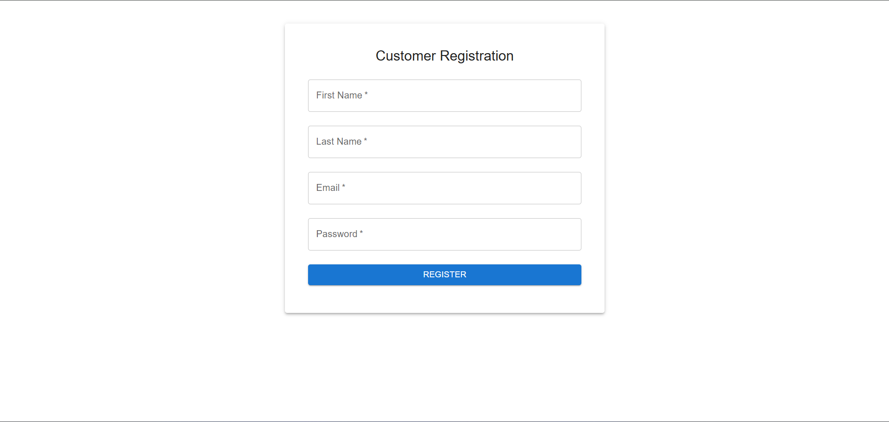
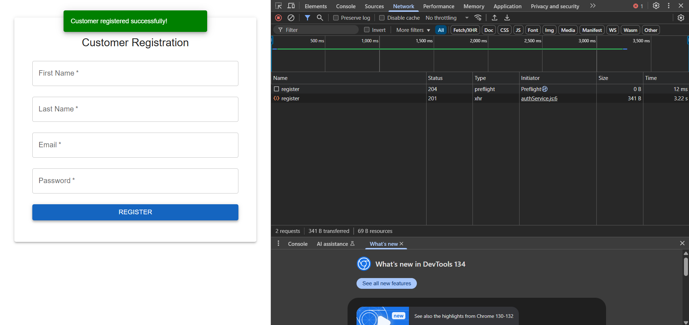
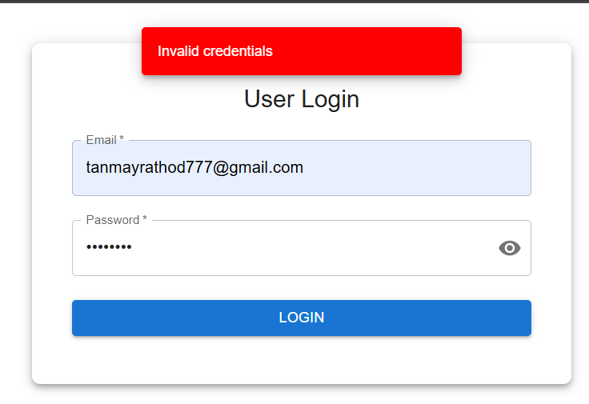
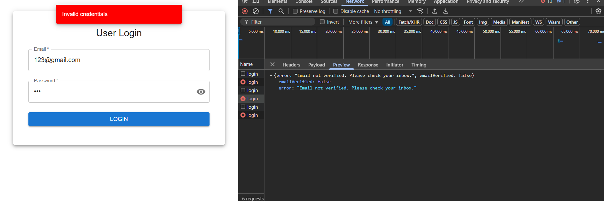
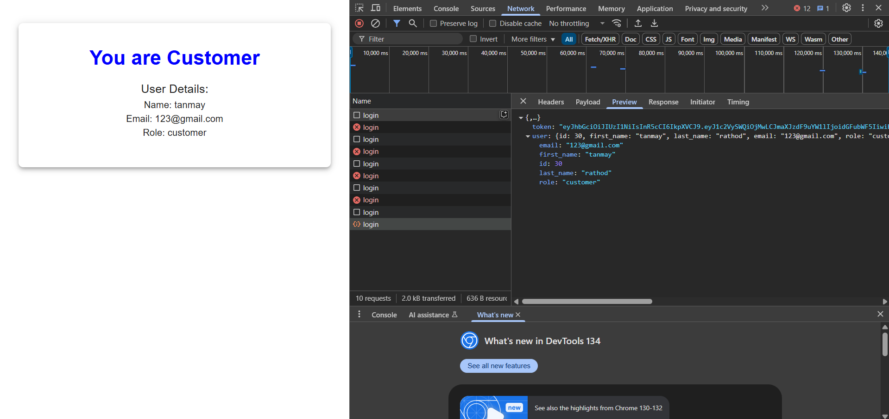

# Frontend

## Introduction
This is the frontend for the application, built using Vite.js for fast development and optimized builds.

## Installation

### Prerequisites
- Node.js (latest LTS version recommended)
- npm or yarn

### Setup
1. Clone the repository:
   ```sh
   git clone <repository_url>
   cd <project_directory>
   ```
2. Install dependencies:
   ```sh
   npm install
   ```

## Running the Development Server
To start the development server, run:
```sh
npm run dev
```

## Building for Production
To create an optimized production build, use:
```sh
npm run build
```

## Routes
The application uses React Router for navigation. Below are the available routes:

| Route | Component |
|--------|--------------------|
| `/register/customer` | CustomerRegister |
| `/register/admin` | AdminRegister |
| `/login/user` | UserLogin |
| `/dashboard` | Dashboard |
| `/verify-email` | VerifyEmail |

 

 



 




